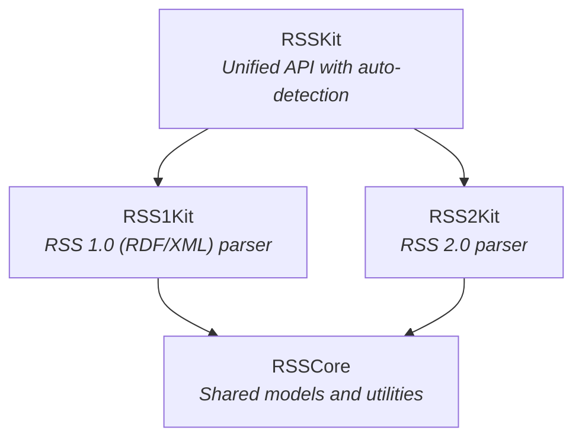

# RSSKit

A lightweight Swift library for parsing RSS feeds with support for RSS 1.0 and RSS 2.0.

## Features

- RSS 1.0 (RDF/XML) and RSS 2.0 parsing
- Automatic format detection
- Modular architecture - use only what you need
- Fully type-safe with Swift's strong typing
- `Sendable` conformance for safe concurrency
- Zero external dependencies (uses only Foundation)
- Comprehensive error handling

## Requirements

- Swift 6.2+
- iOS 16.0+ / macOS 13.0+ / tvOS 16.0+ / watchOS 9.0+ / visionOS 1.0+

## Installation

### Swift Package Manager

Add the following to your `Package.swift`:

```swift
dependencies: [
    .package(url: "https://github.com/Ryu0118/RSSKit.git", from: "0.1.0")
]
```

Then add the appropriate target dependency based on your needs:

```swift
// For auto-detection (RSS 1.0 & 2.0)
.target(name: "YourTarget", dependencies: ["RSSKit"])

// For RSS 2.0 only
.target(name: "YourTarget", dependencies: ["RSS2Kit"])

// For RSS 1.0 only
.target(name: "YourTarget", dependencies: ["RSS1Kit"])
```

Or add it through Xcode: File → Add Package Dependencies.

## Module Structure



| Module | Description | Use Case |
|--------|-------------|----------|
| `RSSKit` | Unified parser with auto-detection | When you need to parse feeds of unknown format |
| `RSS1Kit` | RSS 1.0 parser only | When you only work with RSS 1.0 feeds |
| `RSS2Kit` | RSS 2.0 parser only | When you only work with RSS 2.0 feeds |
| `RSSCore` | Shared types (automatically included) | Not imported directly |

## Usage

### Auto-Detection (Recommended)

Use `RSSKit` when you don't know the feed format in advance:

```swift
import RSSKit

let parser = RSSParser()

// Automatically detects RSS 1.0 or 2.0
let feed = try parser.parse(data)

// Check the version
print(feed.version)  // "1.0" or "2.0"
```

### RSS 2.0 Only

Use `RSS2Kit` for smaller binary size when you only need RSS 2.0:

```swift
import RSS2Kit

let parser = RSS2Parser()
let feed = try parser.parse(data)
```

### RSS 1.0 Only

Use `RSS1Kit` when working exclusively with RSS 1.0 (RDF) feeds:

```swift
import RSS1Kit

let parser = RSS1Parser()
let feed = try parser.parse(data)
```

### Accessing Feed Content

```swift
// Channel metadata
print(feed.channel.title)
print(feed.channel.link)
print(feed.channel.description)

// Optional channel properties
if let language = feed.channel.language {
    print("Language: \(language)")
}

// Iterate over items
for item in feed.channel.items {
    print(item.title ?? "Untitled")
    print(item.description ?? "")

    if let link = item.link {
        print("Read more: \(link)")
    }
}
```

### Working with Dates

```swift
for item in feed.channel.items {
    if let pubDate = item.pubDate {
        let formatter = DateFormatter()
        formatter.dateStyle = .medium
        print("Published: \(formatter.string(from: pubDate))")
    }
}
```

### Podcast Enclosures

```swift
for item in feed.channel.items {
    if let enclosure = item.enclosure {
        print("Media URL: \(enclosure.url)")
        print("Type: \(enclosure.type)")        // e.g., "audio/mpeg"
        print("Size: \(enclosure.length) bytes")
    }
}
```

### Categories

```swift
// Channel categories
for category in feed.channel.categories {
    print(category.value)
    if let domain = category.domain {
        print("  Domain: \(domain)")
    }
}

// Item categories
for item in feed.channel.items {
    let categoryNames = item.categories.map(\.value)
    print("Tags: \(categoryNames.joined(separator: ", "))")
}
```

### Error Handling

```swift
do {
    let feed = try parser.parse(data)
} catch let error as RSSError {
    switch error {
    case .invalidXML(let underlying):
        print("XML parsing failed: \(underlying)")
    case .invalidRSSStructure:
        print("Not a valid RSS feed")
    case .missingRequiredElement(let element):
        print("Missing required element: \(element)")
    case .invalidURL(let urlString):
        print("Invalid URL: \(urlString)")
    case .invalidDateFormat(let dateString):
        print("Could not parse date: \(dateString)")
    case .invalidNumber(let element, let value):
        print("Invalid number in \(element): \(value)")
    case .unsupportedVersion(let version):
        print("Unsupported RSS version: \(version)")
    }
}
```

## Limitations

- **RSS only**: Atom and JSON Feed formats are not supported
- **Read-only**: Feed generation is not supported
- **Standard elements only**: Namespace extensions (e.g., iTunes podcast tags) are ignored

## License

MIT
